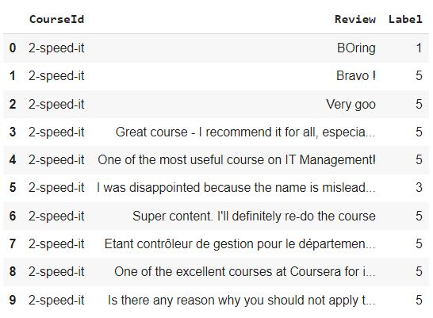
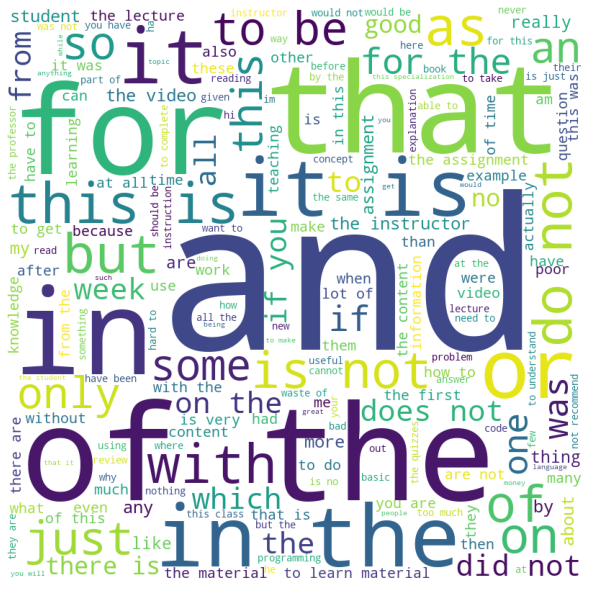
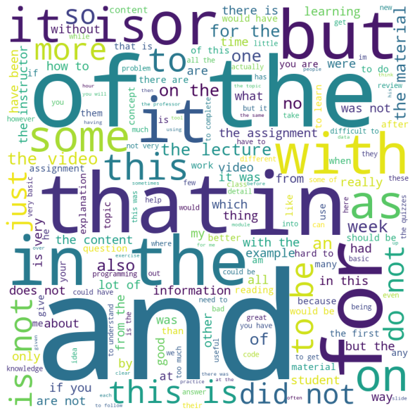
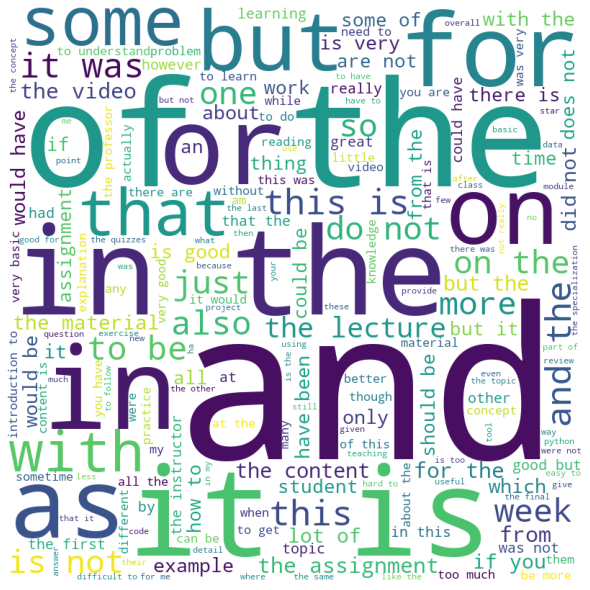
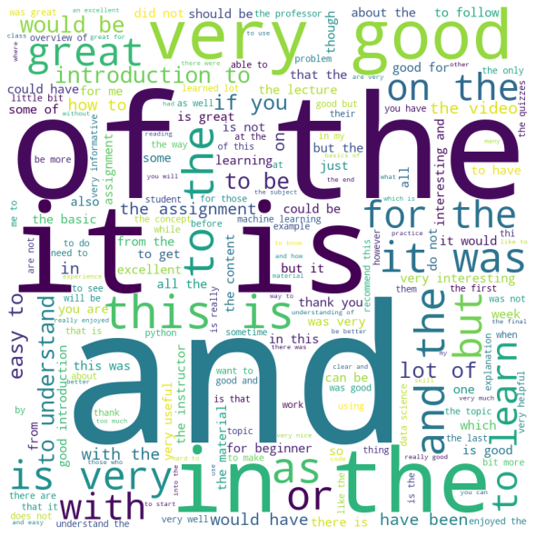

# Coursera-Course-Reviews-Classification

<b>Project:</b> This project is based on the classification of Coursera Course Reviews based on the intent in the text data. A Deep Neural Network was trained to classify the text using LSTM (Long Sort-Term Memory) layer along with DNN (Dense Neural Network).

<b>Dataset:</b> Dataset is extracted from the Coursera. There are 12,5583 distinct review and ratings given on the course. 

<b>Date Exploration:</b> Word Clouds of all the five categories of review were generated to see observe the most frequent words used in those category of reviews. 

Word Cloud of Reviews with 1 star rating

Word Cloud of Reviews with 2 star rating

Word Cloud of Reviews with 3 star rating

Word Cloud of Reviews with 4 star rating

Word Cloud of Reviews with 5 star rating

<b>Observations:</b> From the above word clouds we can observe that those reviews which has 1 star have neutral words (there is no such word - good, excellent). When we look at the reviews with 2 stars, we can see that there is 'GOOD' keyword but it is not very frequent. Instead we can observe that keywords like - 'ASSIGNMENT', 'LECTURE', 'MATERIAL', 'VIDEO' and 'CONTENT' have dominated the word cloud. Students are probably giving feedback on these things. From the review with 3 or more stars, we can observe that as the star increases the frequency of 'GOOD' keyword increased significantly and frequency of words like - 'ASSIGNMENT', 'LECTURE', 'MATERIAL', 'VIDEO' and 'CONTENT' decreases. For the reviews with 5 stars, there is significant percentange of 'GREAT' and 'EXCELLENT' as well.

