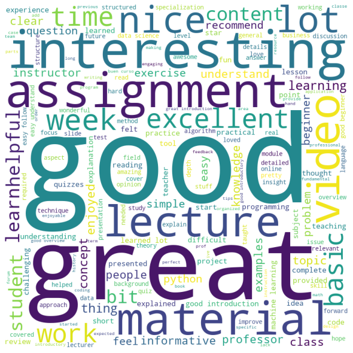

# Coursera-Course-Reviews-Classification

<b>Project:</b> This project is based on the classification of Coursera Course Reviews based on the intent in the text data. A Deep Neural Network was trained to classify the text using LSTM (Long Sort-Term Memory) layer along with DNN (Dense Neural Network).

<b>Dataset:</b> Dataset is extracted from the Coursera. There are 12,5583 distinct review and ratings given on the course. 

<b>Date Exploration:</b> Word Clouds of all the five categories of review were generated to see observe the most frequent words used in those category of reviews. 

Word Cloud of Reviews with 1 star rating

Word Cloud of Reviews with 2 star rating

Word Cloud of Reviews with 3 star rating

Word Cloud of Reviews with 4 star rating

Word Cloud of Reviews with 5 star rating

<b>Observations:</b> From the above word clouds we can observe that those reviews which has 1 star have neutral words (there is no such word - good, excellent). When we look at the reviews with 2 stars, we can see that there is 'GOOD' keyword but it is not very frequent. Instead we can observe that keywords like - 'ASSIGNMENT', 'LECTURE', 'MATERIAL', 'VIDEO' and 'CONTENT' have dominated the word cloud. Students are probably giving feedback on these things. From the review with 3 or more stars, we can observe that as the star increases the frequency of 'GOOD' keyword increased significantly and frequency of words like - 'ASSIGNMENT', 'LECTURE', 'MATERIAL', 'VIDEO' and 'CONTENT' decreases. For the reviews with 5 stars, there is significant percentange of 'GREAT' and 'EXCELLENT' as well.

<b>Results: </b> 

From the below mentioned confusion matrix, we can see that the model was able to predict ~80% of the reviews with 1 star as 1 star. ~13% of missclassfied ratings with 1 star are classfied as 2 star. Since both the 1 star and 2 star review are indicates the same sentiment of user and probably both these categories may have the same contextual information. If we observe the predictions for the reviews with 2 star, we can see the same trend. The missclassified reviews in 2 star categories mostly missclassified as 1 star review. 

On observing the reviews which were classified as 3 stars, we can see that most of the missclassifed reviews were either classied as 2 star or 3 star rating as 3 start ratings are moderate. The missclassified percentage of reviews in these cases (2 stars and 3 stars) are ~14% and ~11% respectively.

For the reviews with 4 and 5 stars, we know that these reviews are posted for those courses which have created huge impact on the users. Most of the reviews under these categories may have positive words such as 'GOOD', 'EXCELLENT', 'GREAT', 'INTERESTING' etc in the reviews. For the ratings with 5 stars we can observe that ~90% of the ratings are classified correctly. Out of the remaining ~10% misclassified rating, ~9% are classfied in rating 4. This is not bad! As rating 4 and 5 signifies almost the same thing.

